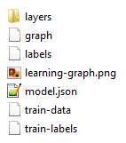
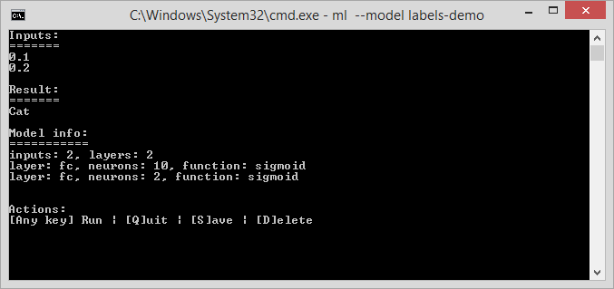
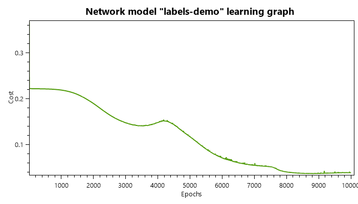
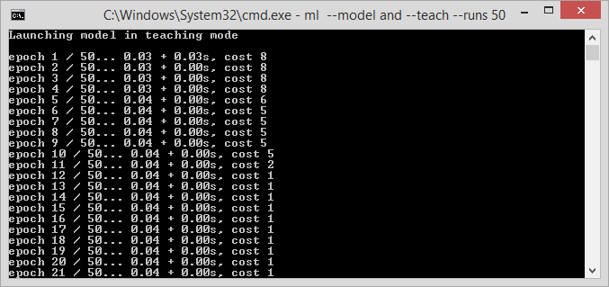
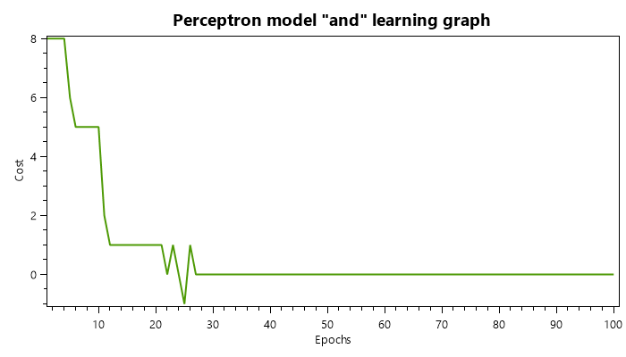
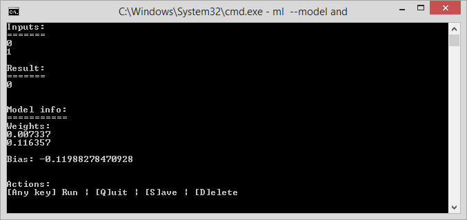

# Machine Learning Sandbox

A small framework I built to study machine learning through the implemention of the algorithms from scratch.

Includes basic perceptron and multilayer neural network with logistic activation functions.

# About the program

Program features two modes: model teaching and model execution loop.

They can be started and configured using these command line parameters:

```
  -d, --debug    (Default: false) Enable debug mode.
  -t, --teach    (Default: false) Run model in teaching mode.
  -m, --model    (Default: default) Name of the model to load.
  --runs         (Default: 0) Number of epochs to run. (0 - unlimited)
  --repeat       (Default: 1) Number of run repeats.
  -i, --input    (Default: input.png) Input data file.
  --help         Display this help screen.
  --version      Display version information.
```

# Models

Model is stored in a `models/*` directory. It contains `model.json` file, which describes the model: how many inputs it has, how many layers and their configuration, learning rate, data transformers, etc.



```json
# model.json
{
  "type": "network",
  "inputs": 2,
  "learningRate": 0.5,
  "batch": "full",
  "transformers": {
	"label": "single",
  },
  "layers": [
    {
      "type": "fc",
      "neurons": 10,
      "function": "sigmoid"
    },
    {
      "type": "fc",
      "neurons": 2,
      "function": "sigmoid"
    }
  ]
}
```

# Showcase

## Network

Network models feature data transformers for both inputs and outputs.

For instance, it can map real number inputs to text outputs (labels):

```
# train-data
0.1	0.2
0.4	0.5
0.8	0.9
```

```
# train-labels
Cat
Dog
Cat
```

```
# labels
Cat
Dog
```





## Perceptron

Perceptron is a simple linear classifier.





